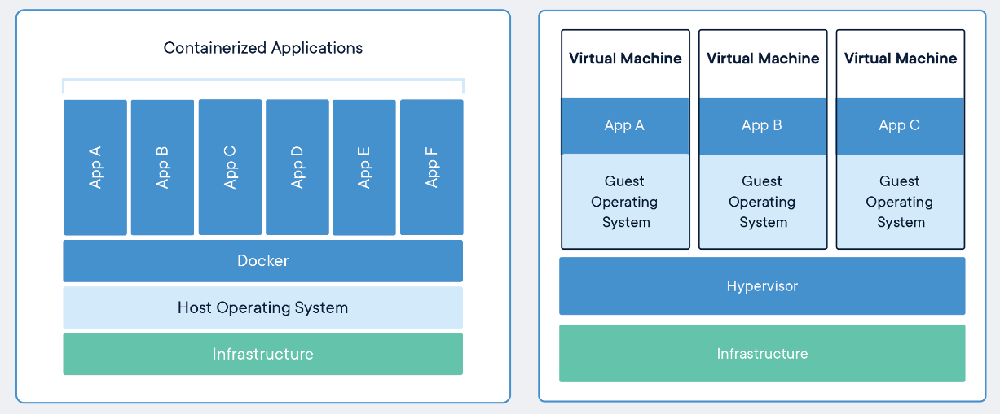

# Docker

## Why Docker?

Docker is like running an application in a Linux VM but without the Overhead of installing the whole OS

- Stable
- Lightweight compared to a VM / 100 MB vs 10 GB (disk space)
- Applications are sandboxed, this they don't conflict each other
- Easily shareable
- Containers can easily get replaced, no new VM needed

[^ Compare-Docker-VM]: Comparing Containers and Virtual Machines | https://www.docker.com/resources/what-container



Ref [^ Compare-Docker-VM]

## Work flow

**[Dockerfile]** ⟶ *builds* ⟶ **[Docker Image]** ⟶ *runs* ⟶ **[Container]**


## Dockerfiles

Images are defined by Dockerfiles which are like configuration file in plaintext

There are shared Dockerfiles available for usage at: <https://hub.docker.com/>


## Docker commands

```bash
docker run <image>                        # creates a new process from the image
docker ps [-a include stopped containers] # lists docker processes
docker start <name|id>                    # starts a stopped process
docker stop <name|id>                     # stops a running process
docker rm <name|id>                       # removes a process
```


### Example running apache

[^ Example-Apache]: Learn Docker in 12 Minutes, by Jake Wright | <https://www.youtube.com/watch?v=YFl2mCHdv24>

1. Describe how the image should be built in the dockerfile

```dockerfile
FROM php:7.0-apache                       # Download dependencies
COPY src/ /var/www/html                   # Copy local files into Image
EXPOSE 80                                 # Configurate port 80 usage in Image
```

2. Build and run the image based on the dockerfile

```bash
docker build -t hello-world               # Build Image into hello-world container
docker run -p 80:80 hello-world           # Run hello-world container with port 80 to 80 mapping
```

3. Optionally mount a local directory during development to avoid constant rebuilding

```bash
docker run -p 80:80 -v /myPath/src:/var/www/html/ hello-world
```

Ref [^ Example-Apache]

